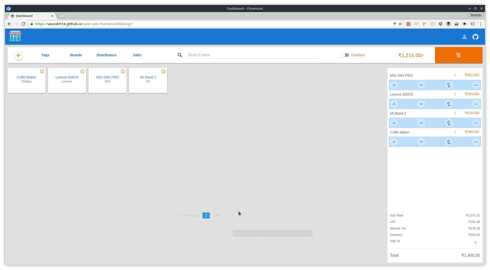
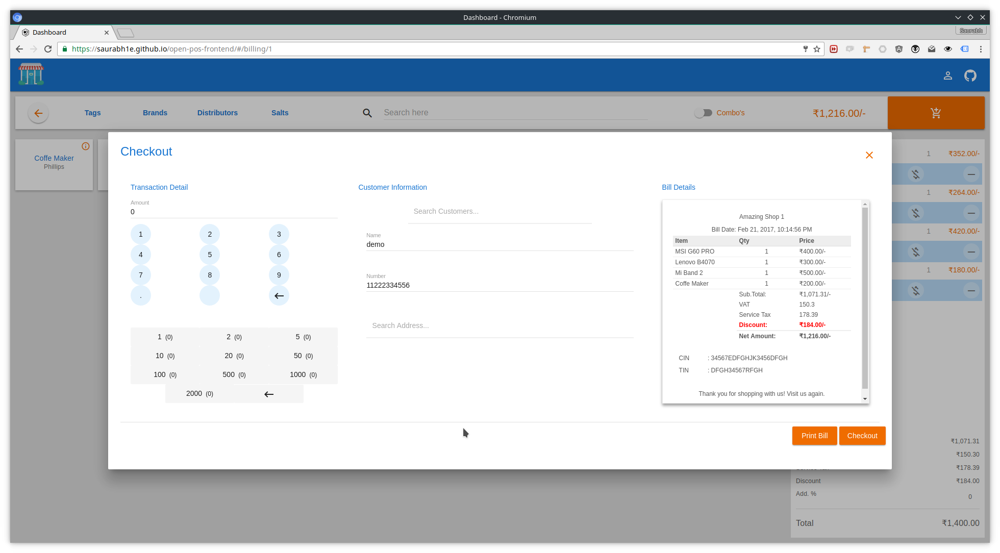
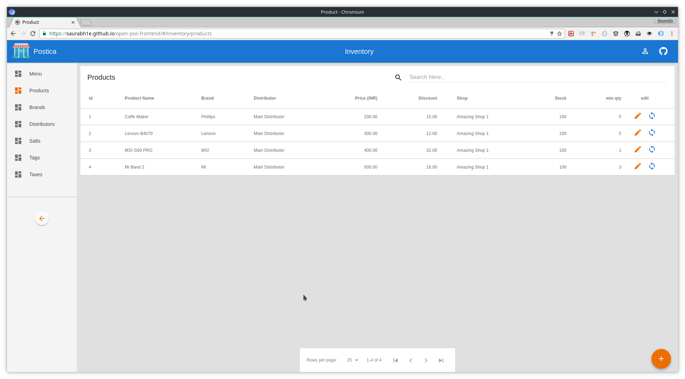

## 
Deprecated
This is no longer supported, please consider using https://github.com/saurabh1e/pos instead.

## Setup

* Ensure you have Node 4.4+ and NPM 3+ installed.
* Install Angular CLI `npm i -g angular-cli@latest`
* Install Typescript 2.0 `npm i -g typescript`
* Install TSLint `npm install -g tslint`
* Install Protractor for e2e testing `npm install -g protractor`
* Install Node packages `npm i`
* Update Webdriver `webdriver-manager update` and `./node_modules/.bin/webdriver-manager update`
* Run local build `ng serve`

### Demo:

url: https://saurabh1e.github.io/open-pos-frontend/#/
username: demo@demo.com
password: demo
